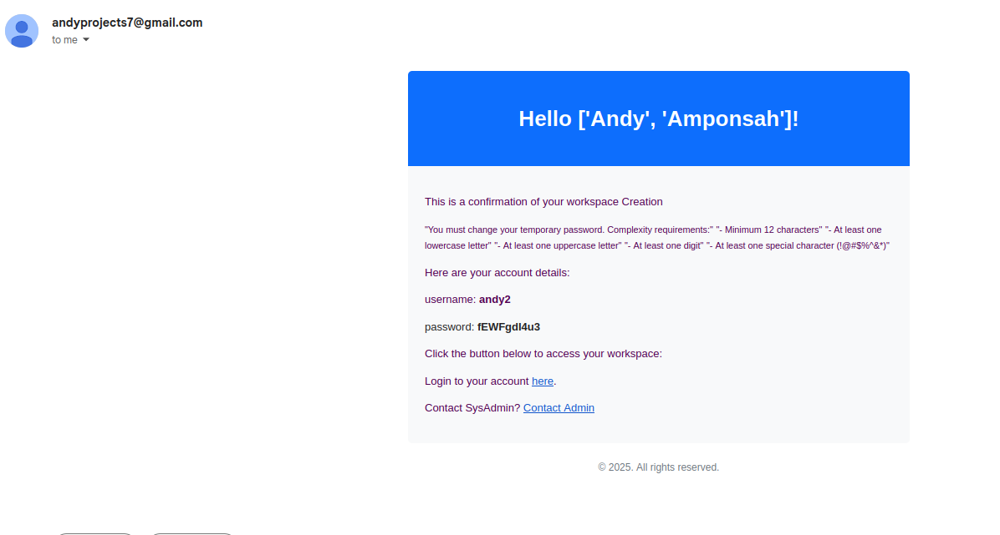
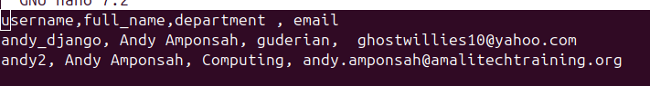
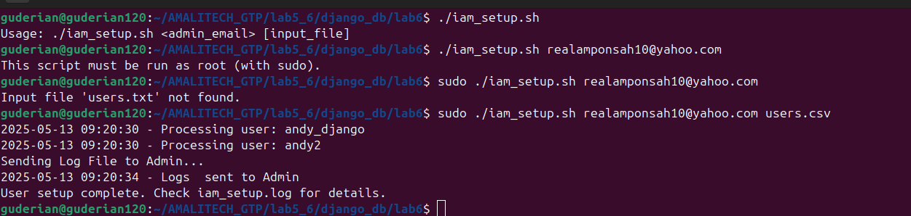

# **User Management System (UMS) - Unified Documentation**  
**Three Independent Tools for User Management**  

---

## **Table of Contents**  
1. [**Overview & Quick Start**](#overview--quick-start)  
2. [**Extensive BASH DOCUMENTATION**](#extensive-iam-documentation) *(Bash Script Deep Dive)*  
3. [**Troubleshooting & FAQs**](#troubleshooting--faqs)  

> ⚠️ This project is intended to run on **Linux systems only** (preferably Ubuntu) and assumes the executing environment has appropriate privileges (sudo access).

---

## Overview & Quick Start 

  


### **Choose Your Workflow**  
This project offers **three independent tools** for user management, Each tool autmates the process of creating users, groups and home directories as well as email login credentials to users and log files to System Administrators:  


## 📚 Resources Table

| Tool            | Use Case                           | Workspace Provisioning  | GitHub Link(s)                                                                        |
| --------------- | ---------------------------------- | ----------------------- | ------------------------------------------------------------------------------------- |
| **Django API**  | Live CSV upload + automated emails | ✅ Yes (WeTTY terminal)  | [Django Workspace System](https://github.com/guderian120/workspace-system-management) |
| **Bash Script** | Local user creation + log emails   | ❌ No (Local users only) | This Repo                                                                                |
| **Python GUI**  | Graphical local user management    | ❌ No (Local users only) | [PyQt5 SysMan](https://github.com/guderian120/PyQt5-SysMan)                           |


---

### **Option 1: Live Workspace (Django API)**  
**Use this if:**  
- You need **automated workspace provisioning** (WeTTY terminal).  
- Users should receive **email links** to access their accounts.  
## Sample Email

#### **Steps:**  
1. **Upload CSV** (Strict format required):  
   ```bash
   curl -X POST -F "csv_file=@users.csv" http://34.252.60.35:8080/upload/
   ```  
   **CSV Headers:** `username,full_name,department,email`  

2. **Users receive emails** with:  
   - Temporary password  
   - Link to **live interactive workspace** (WeTTY).  

---

### **Option 2: Local User Management (Bash/Python GUI)**  
**Use these if:**  
- You only need **local user creation** (no remote workspace).  
- Prefer CLI (`Iam_setup.sh`) or GUI (`gui_sys_management.py`).  

#### **Bash Script**  
```bash
sudo ./Iam_setup.sh admin@example.com users.csv
```  
- Creates local users.  
- Emails logs to the admin.  

#### **Python GUI**  
```bash
python3 gui_sys_management.py
```  
- Graphical CSV upload.  
- Optional email logs.  

---

## **2. Key Differences**  
| Feature | Django API | Bash Script | Python GUI |  
|---------|------------|-------------|------------|  
| **Remote Workspace** | ✅ Yes | ❌ No | ❌ No |  
| **Email Notifications** | ✅ Yes | ✅ Yes | ✅ Optional |  
| **Execution** | `curl` POST | CLI (`sudo`) | GUI (PyQt5) |  
| **Best For** | Teams/clients | SysAdmins (CLI) | SysAdmins (GUI) |  

---

## **3. Troubleshooting & FAQs**  
### **❌ Why is my CSV failing?**  
- **Django API**: Ensure headers are **exact**: `username,full_name,department,email`.  
- **Bash/Python**: Supports flexible formats but requires valid emails.  

### **❌ No workspace link received?**  
- Check your Spam folder **Django API** Emails are sometimes moved to the spam 
- Only the **Django API** provisions workspaces. Bash/Python are for **local users only**.  

### **❌ GUI not launching?**  
- Install dependencies:  
  ```bash
  pip install -r requirements.txt
  ```  

---


**🚀 Ready to Deploy?**  
- Need **live workspaces?** → Use the Django API.  
- Just **local users?** → Bash or Python GUI.  

**Test the live demo:**  
```bash
curl -X POST -F "csv_file=@users.csv" http://34.252.60.35:8080/upload/
```  
*(Use real emails to receive workspace links, Check your spam if email not received!)*  

## **Extensive IAM Documentation**  
### **Bash Script (`Iam_setup.sh`) Deep Dive**  
### **CSV Sample File**  


### **Script Execution **  



#### **Core Functionality**  
- Creates local users from a CSV.  
- Emails temporary passwords to users and logs to an admin.  
- Enforces password complexity via `pam.d` and `/etc/security/pwquality.conf`.  

#### **Script Workflow**  
1. **Initial Checks**  
   ```bash
   # Admin email and sudo check
   if [[ -z "$1" ]]; then
     echo "Usage: $0 <admin_email> [input_file]"
     exit 1
   fi
   if [ "$(id -u)" -ne 0 ]; then
     echo "This script must be run as root (with sudo)." >&2
     exit 1
   fi
   ```

2. **CSV Processing**  
   ```bash
   while IFS=',' read -r username fullname group email || [ -n "$username" ]; do
     [[ "$username" == "username" || -z "$username" ]] && continue  # Skip header
     echo "$(date '+%Y-%m-%d %H:%M:%S') - Processing user: $username" | tee -a "$LOG_FILE"
   ```

3. **User & Group Creation**  
   ```bash
   if ! getent group "$group"; then
     groupadd "$group" 2>> "$LOG_FILE"
   fi
   if ! id "$username" &>/dev/null; then
     useradd -m -c "$fullname" -g "$group" "$username" 2>> "$LOG_FILE"
     TEMP_PASSWORD=$(generate_temp_password)
     echo "$username:$TEMP_PASSWORD" | chpasswd
   ```

4. **Password Policies**  
   ```bash
   chage -d 0 "$username"       # Force password change on first login
   chmod 700 "/home/$username"  # Restrict home directory access
   ```

5. **Email Notifications**  
This script calls on a custom python email server to handle all email sending. This ensure the code is compatible with most linux systems and makes the code look clean and better overall
   - Uses `email_server.py` to send:  
     - **User Email**: Temp password and instructions.  
     - **Admin Email**: Log file after completion.  

#### **Key Configuration Files**  
- **`/etc/security/pwquality.conf`** (Custom password rules):  
  ```ini
  minlen = 12
  dcredit = -1  # Require 1 digit
  ucredit = -1  # Require 1 uppercase letter
  ```

- **`email_server.py`** (SMTP Setup):  
  ```python
  def send_email(to_email, name, username, user_password):
      # Uses Gmail SMTP (hardcoded credentials for demo)
      server = smtplib.SMTP('smtp.gmail.com', 587)
      server.starttls()
      server.login("dummy@gmail.com", "app_password")
  ```

#### **Usage Examples**  
```bash
# Default CSV (users.csv)
sudo ./Iam_setup.sh admin@example.com

# Custom CSV
sudo ./Iam_setup.sh admin@example.com custom_users.csv
```

---


## **Troubleshooting & FAQs**  
### **IAM-Specific Issues**  
❌ **"Input file not found"**  
- Ensure `users.csv` exists or specify a path:  
  ```bash
  sudo ./Iam_setup.sh admin@example.com /path/to/users.csv
  ```

❌ **Admin Email Errors**  
- This Script requires an **Administrator_Email** as an argument. Log files are sent to this user after script is run.  
```bash
sudo ./Iam_setup.sh admin@example.com
```

❌ **Password Complexity Failures**  
- Verify `/etc/security/pwquality.conf` matches the required rules.  

---

